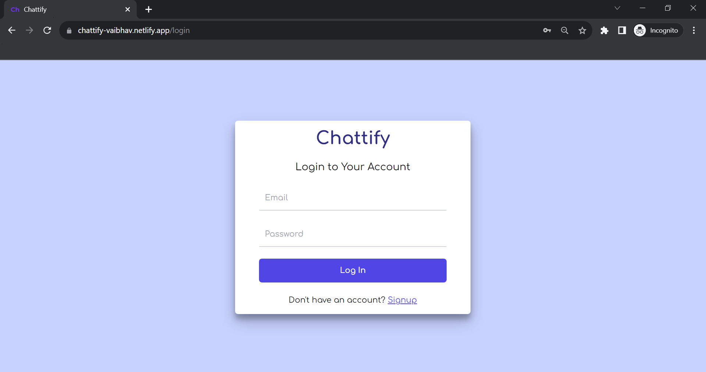
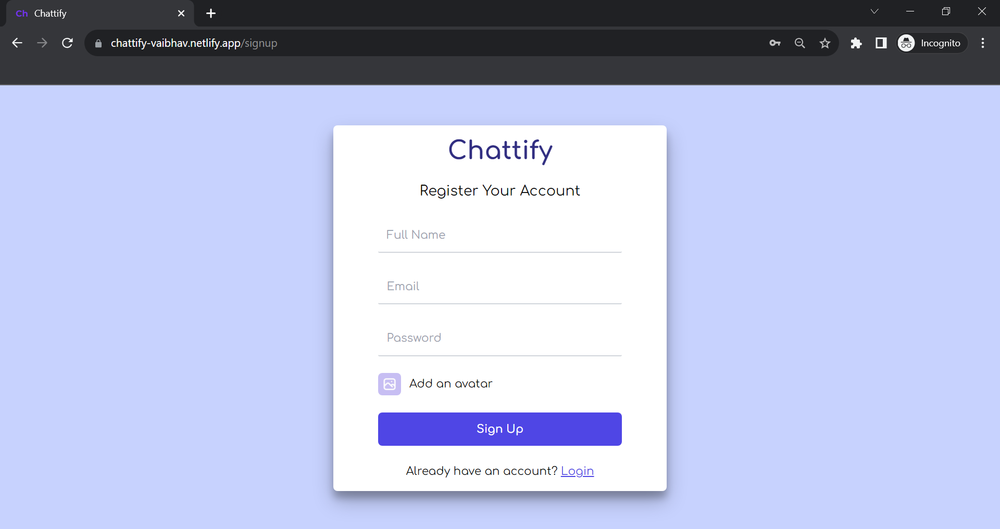
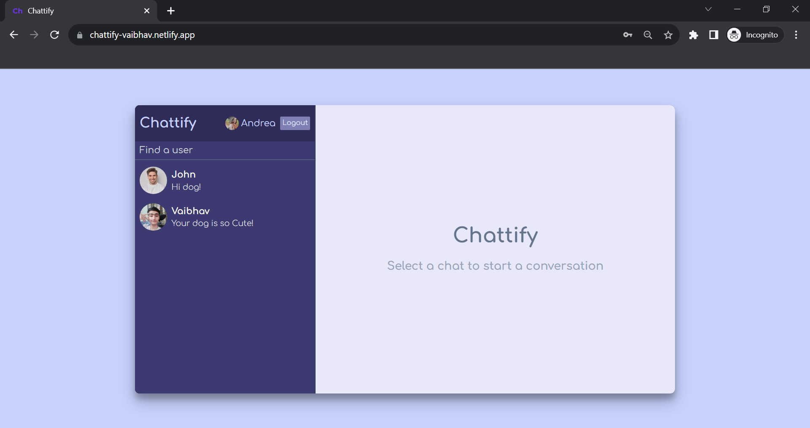
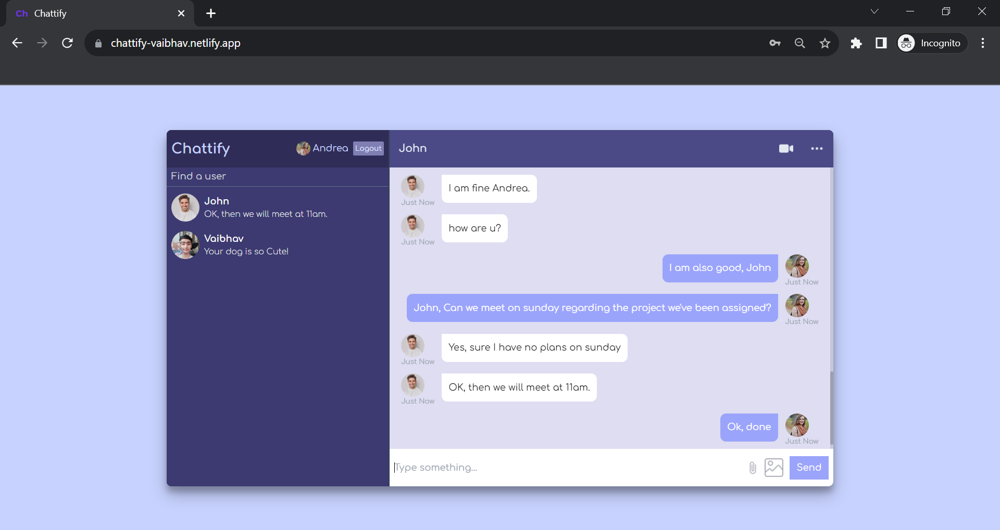
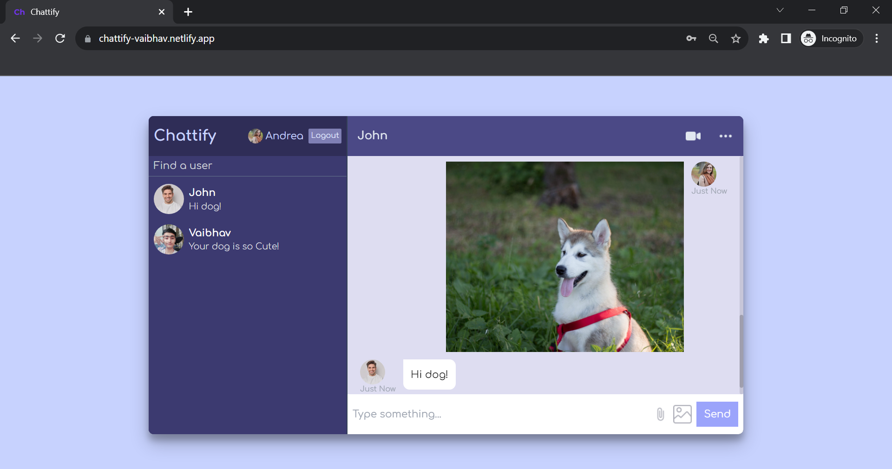

# Chattify (Realtime Private Chat App)

A Web Application which ease the communication between two parties, by provinding them a realtime private chatting environment.

## Live Demo

<table>
  
  <tr>
    <td></td>
    <td></td>
  </tr>
  <tr>
    <td></td>
    <td></td>
  </tr>
  <tr>
    <td></td>
  </tr>
  
 </table>

Live Website: [Chattify](https://chattify-vaibhav.netlify.app/)

## Used Libraries
- `react-js`
- `redux`
- `tailwind css`
- `firebase`

## Features

- Realtime Private Chat.
- Create or login to your account to start a conversation.
- Can search a user to start new conversation.
- Send texts or images privately to a user.

